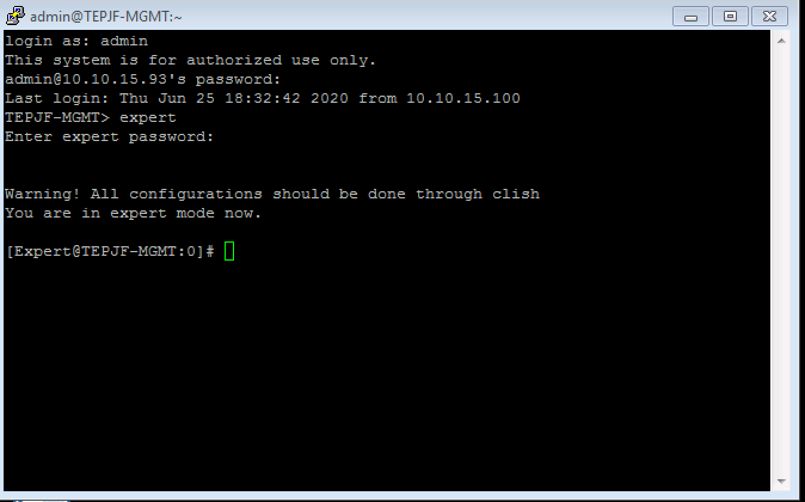
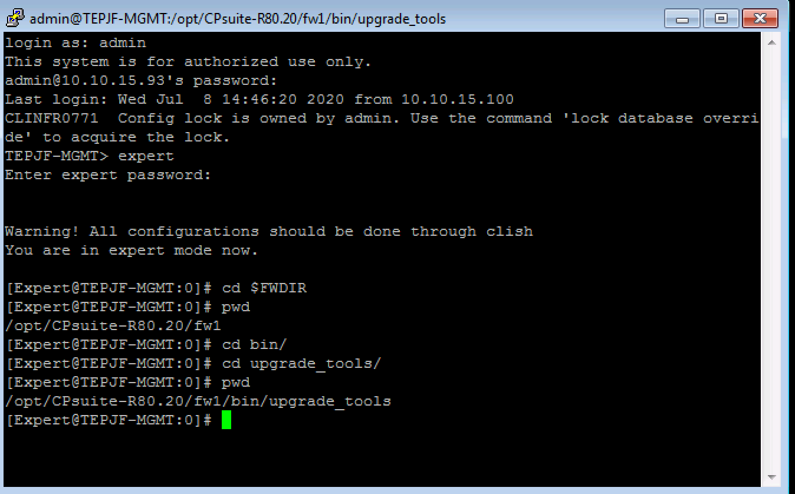
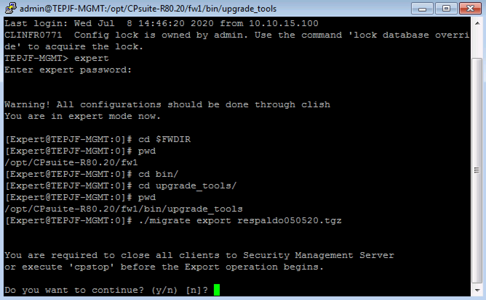

# Respaldo para reporte de Nipper

## Se realiza un reporte por cada Politica de Seguridad, por tal motivo se requiere sacar los archivos mencionados en este documento por cada reporte a realizar, por ejemplo, si la consola de administracion tiene 3 politicas de seguridad (Sala Superior, Avena y Virginia) se necesitan obtener 3 veces estos archivos. 
## Para sacar el reporte de cada Politica de Seguridad se requiere instalar politica antes de obtener los archivos, por ejemplo, para obtener el reporte de Avena de Trife se debe aplicar politica en Avena antes de sacar los archivos.

Se requieren los siguientes archivos para poder obtener el reporte de Nipper 

- objects.C
- objects.C_41
- objects_5_0.C
- rulebases_5_0.fws

Para poder copiar estos archivos se levantara una Maquina virtual para no hacer cambios en el equipo del cliente. 
Se requiere sacar un resplado de la politica de seguridad configurada en la consola que administra los FW usando la herramienta "Migration Tools", a continuacion se muestran los pasos a seguir para sacar dicho respaldo: 

1.- Conectarse por linea de comando al "Security Management Server"

2.- Entrar al modo experto con el comando "expert"

   

3.- Ir a la carpeta "/opt/CPsuite-R80.20/fw1/bin/upgrade_tools" 

cd $FWDIR/bin/upgrade_tools

   

4.- Crear el respaldo de la configuracion: 

[Expert@MGMT:0]# ./migrate export repaldo_FW_fwcha.tgz

5.- En este punto te pedira cerrar todos los clientes conectados al Security Management Server, despues de validar que todos los clientes se hayan cerrado continuar presionando la letra "y".

   

6.- Posterior te confirmara que el archivo se creo de forma satisfactoria. 

7.- Sacar el archivo del Security Management Server, se puede usar el cliente WinSCP para copiar el archivo. 

Para poder copiar los archivos necesarios para realizar el reporte, se montara el respaldo en una maquina virtual. 

1.- Crear Maquina Virtual con la misma version de GAIA del Security Management Server. 

2.- Copiar el archivo a la Maquina Virtual antes mencionada. 

3.- Conectarse por linea de comando a la Maquina Virtual 

4.- Entrar al modo experto con el comando "expert"

5.- Ir a la carpeta "/opt/CPsuite-R80.20/fw1/bin/upgrade_tools" 

cd $FWDIR/bin/upgrade_tools

6.- Cargar el respaldo de la configuracion: 

[Expert@MGMT:0]# ./migrate import repaldo_FW_fecha.tgz 

   

7.- Confirmar la carga del respaldo en la Maquina Virtual. 

8.- Validar que la configuracion se haya cargado de forma correcta, conectarse por el Smarconsole. 

## Los siguientes pasos se deben 1 vez por cada reporte de Nipper

## En el caso de TRIFE hay diferentes politicas de seguridad y se necesita un reporte por cada politica, para sacar el reporte de Sala Superior se aplica politica en el Cluster de Sala Superiror y se obtienen los archivos para sacar el reporte de Sala Superor

## Para sacar el reporte de Avena, se requiere aplicar politica en el Cluster de Avena y posteriormente obtener estos archivos. 

Sacar archivos de Maquina Virtual. 

1.- Conectarse a la maquina virtual con la configuracion del cliente. 

2.- Siturse en la carpeta $FWDIR/conf

3.- Buscar los archivos 

- objects.C
- objects.C_41
- objects_5_0.C
- rulebases_5_0.fws

4.- Copiar los archivos a la maquina donde esta intalado la aplicacion Nipper
